# BidCraft — AI-Powered RFP Automation

> Transform your RFP response process from 40–60 hours of repetitive work into a streamlined, AI-assisted workflow that produces a polished first draft in minutes.

<!-- Replace the placeholder below with a real screenshot once deployed -->


---

## The Problem

IT services companies waste **40–60 hours** responding to each RFP — manually hunting through past proposals, copy-pasting boilerplate, and formatting Word documents. Most of that effort is repetitive and doesn't require expert judgment. The people who know the answers are blocked by the people doing the formatting.

## The Solution

BidCraft automates the repetitive parts using a **RAG (Retrieval-Augmented Generation)** pipeline backed by your company's own knowledge base:

| Feature | What it does |
|---------|-------------|
| **AI question extraction** | Upload a PDF or Word RFP — Claude extracts every question, assigns a category, and flags mandatory items |
| **Semantic KB search** | Voyage AI embeddings + Supabase pgvector finds the most relevant past answers from your knowledge base |
| **RAG response generation** | Claude generates a tailored draft using KB context, company profile, and configurable tone / length |
| **Confidence scoring** | Every response gets a 0–100 confidence score so reviewers know exactly where to focus |
| **Rich text review workflow** | TipTap editor, inline feedback, star ratings, edit-distance tracking — structured review from draft to approved |
| **Professional Word export** | One-click export with cover page, table of contents, category sections, and appendix |

---

## Architecture

```
Upload RFP  →  Parse Document  →  Extract Questions  →  Search Knowledge Base  →  Generate Responses  →  Review & Edit  →  Export DOCX
PDF/DOCX       Claude Vision        Categorized             Voyage AI +                Claude Sonnet            TipTap             docx
               + Mammoth            + Confidence            pgvector (RAG)             (grounded in KB)         Editor             library
```

### Data Flow Diagram

```mermaid
flowchart LR
    A["📄 Upload RFP\nPDF / DOCX"] --> B["🔍 Document Parser\nClaude Vision + Mammoth"]
    B --> C["📋 Question Extraction\nCategory + Confidence score"]
    C --> D["🔎 Semantic Search\nVoyage AI Embeddings"]
    D --> E[("🗄️ Supabase pgvector\nKnowledge Base\n~240 entries")]
    E --> F["🤖 Response Generation\nClaude Sonnet — RAG"]
    F --> G["✏️ Review & Edit\nRich Text + Feedback"]
    G --> H["📥 Export\nWord Document"]

    style A fill:#7c3aed,color:#fff
    style F fill:#0891b2,color:#fff
    style E fill:#059669,color:#fff
    style H fill:#dc2626,color:#fff
```



---

## Technology Stack

| Layer | Technology | Justification |
|-------|-----------|--------------|
| **Framework** | Next.js 16 (App Router) | Full-stack React with colocated API routes, server components, and TypeScript end-to-end |
| **AI Model** | Anthropic Claude Sonnet 4 | Best-in-class reasoning for structured document parsing and long-form professional writing |
| **Embeddings** | Voyage AI `voyage-3-lite` | 512-dimensional semantic embeddings optimised for retrieval quality at low cost |
| **Vector DB** | Supabase + pgvector | PostgreSQL cosine-similarity search with no extra infrastructure; pairs naturally with existing auth/storage |
| **Rich Text** | TipTap 3 (ProseMirror) | Headless, extensible editor — full formatting control without a heavy third-party UI |
| **Word Export** | `docx` v9 | Programmatic DOCX generation with cover page, TOC, and section formatting |
| **State** | Zustand + localStorage | Lightweight client-state with zero backend auth complexity for an MVP |
| **Styling** | Tailwind CSS 4 | Utility-first dark-mode-first design system |
| **Language** | TypeScript 5 (strict) | End-to-end type safety across API routes, service layer, and UI components |

---

MIT © 2025 Bhargav Hari
